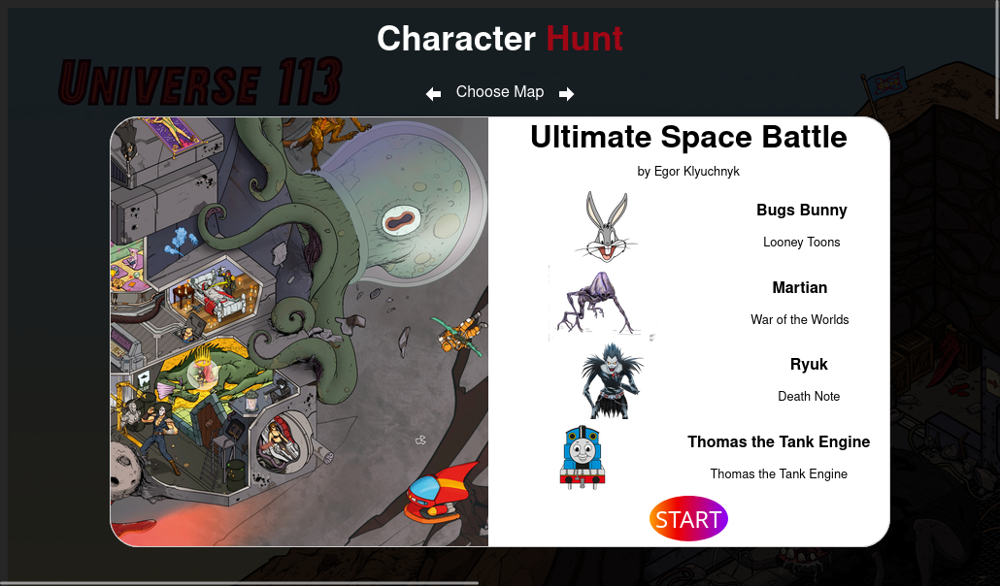

# Readme
# Character Hunt

## Overview

A Where's Waldo type game in which you must find only a few select characters out of hundreds of 
your favorites from TV, movie, video game, comic book, and pop-culture .  The player can choose from
three stunning illustrations (which I refer to as "maps"): Ultimate Space Battle, Universe 113, and 
The Loc Nar.  All which were drawn by Egor Klyuchnyk, an illustrator and concept artist from Kyiv, 
Ukraine. 

I paid Egor for his work and contacted him to make sure that it was OK to use his artwork in my 
, which he agreed to.

### Screenshot

  

### Links

- [Live site](https://mattdimicelli.github.io/Character_Hunt/)
- [Repo](https://github.com/mattdimicelli/Character_Hunt)

## My process

### Built with

- Custom, responsive CSS written in CSS Modules
- React hooks including useContext, useState, useEffect
- Utility modules such as Tippyjs/react for the dropdown menu and the popovers, react-modal, 
  react-toastify for "toast notifications", react-icons, and react-image-map
- Firebase and reactfire

### What I learned

I learned about the HTML `<map>` element, it's use-cases and syntax, and how 
it is associated with an ``.  I realized that as the size of the ``
changed (due to responsive design) the `<map>` functionality would break.  react-
image-map creates an ImageMap component which solves this problem using percent-based
map areas.

It turns out that React does not natively support inline CSS media queries (eg. using a style object inline).  An external stylesheet can be used for media queries.  A "CSS Module" stylesheet (which must end in .module.css) are advantageous over regular stylesheets because the styles aren't accessible in children components; they are local scoped.  Alternatively a third-party library such as react-responsive or react-media-hook.  Or, as I've used in previous projects, Tailwind.

Use value of `unset` with CSS property `all` to remove all the default styles for
a given element.

According to CSS Modules documentation, camelCase is recommended for class names (as opposed to kebab-case).  Names *could* be accessed with bracket notation for kebab-case but it could also cause issues.

CSS `object-fit` property: `contain` fits according to aspect ratio, `fill` stretches object to fill, and `cover` overflows container but maintains ratio.

One way to get Flexbox to shrink images to fit: set `nowrap` on the flexbox container, and then `width: 100%` on the `` children.

With tippy-react, if you're using a component element as a child of the Tippy component, you have to forward the ref to the DOM node.  If unable to do so, must wrap the 
component element in a span.

Creating a custom cursor using CSS and JS is quite complicated.  A simpler alternative is using an image as a custom cursor.  However, the max image size varies per browser.

Although it is possible to use a class variable to store data instead of state (in a React class 
component), most of the time it is better to use state since React will control the rendering
of the associated component(s) as needed.

Before I was trying to keep my JS line-lengths at 80 chars or below, however, I have realized that
with JSX 80 chars are too few and in this project I keep my line length at or below 100 chars.

While with React class components you could get a callback as a second argument to setState(), to 
run after the state was updated, with the useState() hook a callback cannot be provided.  Instead,
useEffect can be used to monitor for changes in the state and execute code then.

